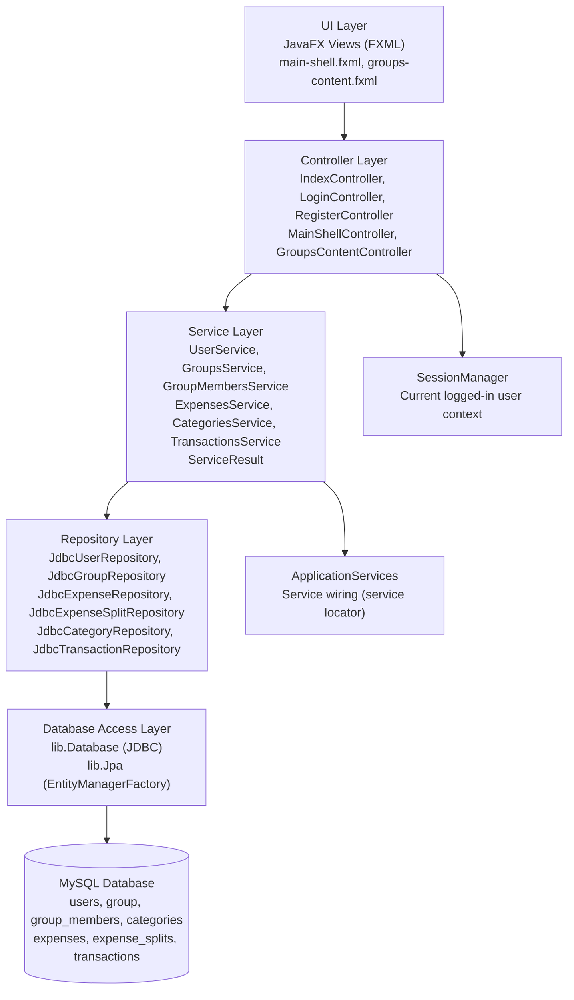
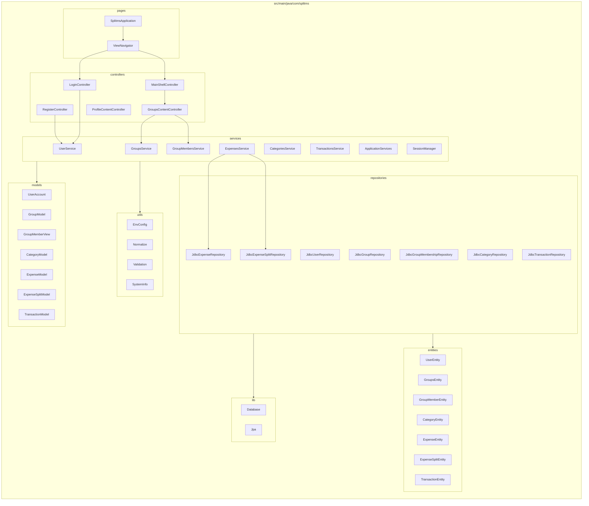
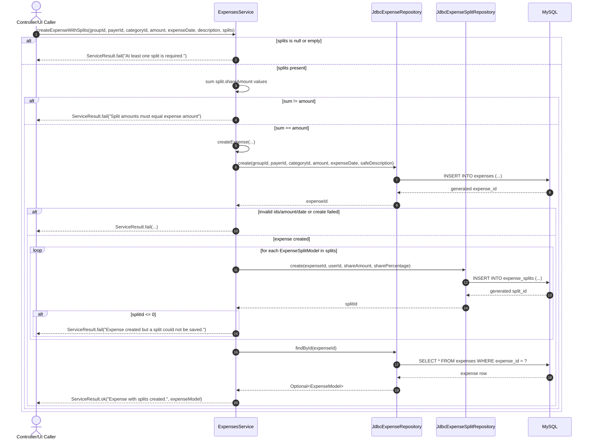

# splitms-java

A split-expense desktop application built with JavaFX 25 and Maven. Users can register, create groups, add friends as members, log shared expenses with per-user splits, and track settlement transactions — all backed by a live MySQL database.

## Tech stack

| Layer | Technology |
|-------|------------|
| UI | JavaFX 25 + FXML |
| ORM | Hibernate 6.4.4 / Jakarta Persistence 3.1 |
| Data access | Pure JDBC (repository layer) |
| Database | MySQL 8+ (mysql-connector-j 9.4.0) |
| Migrations | Flyway 12.1.0 |
| Security | PBKDF2WithHmacSHA256 (65 536 iterations) |
| Testing | JUnit 4.13.2 |
| Build | Maven 3, Java 25 |

---

## Prerequisites

- Java 25+ (JDK)
- Maven 3.6+
- Docker (for local MySQL)

---

## Quickstart

**1. Start MySQL:**
```bash
docker compose -f docker/mysql-splitms/docker-compose.yml up -d
```

**2. Supply environment variables** (choose one):

*Option A — export in the shell:*
```bash
export DB_HOST=localhost
export DB_PORT=3306
export DB_NAME=splitms
export DB_USER=<your_user>
export DB_PASSWORD=<your_password>
```

*Option B — create a `.env` file in the project root:*
```
DB_HOST=localhost
DB_PORT=3306
DB_NAME=splitms
DB_USER=<your_user>
DB_PASSWORD=<your_password>
```
`EnvConfig` loads `.env` automatically at startup; shell exports take precedence.

**3. Run Flyway migrations:**
```bash
mvn flyway:migrate
```

**4. Run the app:**
```bash
mvn clean javafx:run
```

## Build

```bash
mvn clean package
```

## Tests

Tests connect to the live MySQL database. The schema must be migrated before running tests (step 3 above).

```bash
mvn test
```

---

## Environment variables

| Variable | Default | Description |
|----------|---------|-------------|
| `DB_HOST` | — | MySQL host |
| `DB_PORT` | `3306` | MySQL port |
| `DB_NAME` | — | Database name |
| `DB_USER` | — | MySQL username |
| `DB_PASSWORD` | — | MySQL password |

---

## Architecture overview

The app follows a layered architecture with strict separation of concerns:

```
┌─────────────────────────────────────────────────┐
│  Pages  (SplitmsApplication, ViewNavigator)      │  Entry point, scene/stage management
├─────────────────────────────────────────────────┤
│  Controllers  (JavaFX / FXML)                    │  UI event handlers, view state
├─────────────────────────────────────────────────┤
│  Services                                        │  Business logic, validation
│    └── returns ServiceResult<T>                  │  Typed success/failure wrapper
├─────────────────────────────────────────────────┤
│  Repositories  (interfaces + JDBC impls)         │  SQL queries, entity mapping
├─────────────────────────────────────────────────┤
│  Database  (JDBC connection singleton)           │  Connection pool, executeQuery/Update
├─────────────────────────────────────────────────┤
│  MySQL                                           │  Persistent storage
└─────────────────────────────────────────────────┘
```

**Cross-cutting concerns:**
- `SessionManager` — singleton that holds the currently logged-in user's `userId`, `name`, and `email` in memory for the duration of the app session.
- `ServiceResult<T>` — a Java record `(boolean success, String message, T data)` returned by every service method. Controllers check `.success()` before reading `.data()`.
- `ApplicationServices` — a static service-locator class that wires repositories into services and exposes `userService()`, `groupsService()`, and `groupMembersService()`.
- `JPA/Hibernate` is used via `Jpa.java` for `EntityManagerFactory` access (entity persistence). Day-to-day queries use pure JDBC via `Database.java`.

---

## Project layout

```
src/
  main/
    java/com/splitms/
      controllers/          # JavaFX FXML controllers (one per view)
      entities/             # JPA entities (7 classes, one per table)
      interfaces/           # Service + domain interfaces (8 total)
      lib/                  # Database.java (JDBC), Jpa.java (Hibernate EMF)
      models/               # Immutable Java records used as DTOs (7 total)
      pages/                # App entry point (SplitmsApplication) + ViewNavigator
      repositories/         # Repository interfaces (7) + JDBC implementations (7)
      services/             # Business logic services (6) + helpers + security/
        security/           # PasswordHasher interface + Pbkdf2PasswordHasher
      utils/                # EnvConfig, Normalize, Validation, SystemInfo
    resources/
      com/splitms/
        views/              # FXML layout files (9 files)
        styles/             # app.css
      db/migration/         # Flyway SQL (V1–V7)
      META-INF/
        persistence.xml     # JPA/Hibernate configuration
  test/
    java/com/splitms/
      services/             # Integration test suites (6, require live DB)
```

---

## Database schema

Managed by Flyway (`src/main/resources/db/migration`). Migrations must be applied in order before running the app or tests.

> **Note:** `group` is a reserved SQL keyword and is backtick-quoted in all raw SQL.

### V1 — `users`

| Column | Type | Constraints |
|--------|------|-------------|
| `id` | INT | PK, AUTO_INCREMENT |
| `name` | VARCHAR(200) | NOT NULL |
| `email` | VARCHAR(320) | NOT NULL, UNIQUE |
| `password_hash` | VARCHAR(200) | NOT NULL |
| `created_at` | TIMESTAMP | DEFAULT CURRENT_TIMESTAMP |

### V2 — `` `group` ``

| Column | Type | Constraints |
|--------|------|-------------|
| `group_id` | INT | PK, AUTO_INCREMENT |
| `user_id` | INT | NOT NULL, FK → `users.id` ON DELETE CASCADE |
| `group_name` | VARCHAR(200) | NOT NULL |
| `description` | VARCHAR(500) | NOT NULL |
| `is_personal_default` | BOOLEAN | DEFAULT FALSE |
| `created_at` | TIMESTAMP | DEFAULT CURRENT_TIMESTAMP |

Each user gets one personal default group created automatically on registration (`is_personal_default = true`).

### V3 — `group_members`

| Column | Type | Constraints |
|--------|------|-------------|
| `id` | INT | PK, AUTO_INCREMENT |
| `group_id` | INT | NOT NULL, FK → `` `group`.group_id `` ON DELETE CASCADE |
| `user_id` | INT | NOT NULL, FK → `users.id` ON DELETE CASCADE |
| `added_at` | TIMESTAMP | DEFAULT CURRENT_TIMESTAMP |
| — | — | UNIQUE(`group_id`, `user_id`) |

### V4 — `categories`

| Column | Type | Constraints |
|--------|------|-------------|
| `category_id` | INT | PK, AUTO_INCREMENT |
| `category_name` | VARCHAR(100) | NOT NULL |
| `category_type` | VARCHAR(50) | NOT NULL |
| `icon` | VARCHAR(100) | NOT NULL |

Pre-defined expense categories (e.g., Food, Transport, Entertainment).

### V5 — `expenses`

| Column | Type | Constraints |
|--------|------|-------------|
| `expense_id` | INT | PK, AUTO_INCREMENT |
| `group_id` | INT | NOT NULL, FK → `` `group`.group_id `` ON DELETE CASCADE |
| `payer_id` | INT | NOT NULL, FK → `users.id` ON DELETE CASCADE |
| `category_id` | INT | NOT NULL, FK → `categories.category_id` ON DELETE CASCADE |
| `amount` | DECIMAL(10,2) | NOT NULL |
| `expense_date` | DATE | NOT NULL |
| `description` | VARCHAR(500) | NOT NULL |

### V6 — `expense_splits`

| Column | Type | Constraints |
|--------|------|-------------|
| `split_id` | INT | PK, AUTO_INCREMENT |
| `expense_id` | INT | NOT NULL, FK → `expenses.expense_id` ON DELETE CASCADE |
| `user_id` | INT | NOT NULL, FK → `users.id` ON DELETE CASCADE |
| `share_amount` | DECIMAL(10,2) | NOT NULL |
| `share_percentage` | FLOAT | NOT NULL |
| — | — | UNIQUE(`expense_id`, `user_id`) |

The service validates that the sum of all `share_amount` values equals the parent expense's `amount` before persisting.

### V7 — `transactions`

| Column | Type | Constraints |
|--------|------|-------------|
| `transaction_id` | INT | PK, AUTO_INCREMENT |
| `group_id` | INT | NOT NULL, FK → `` `group`.group_id `` ON DELETE CASCADE |
| `from_user_id` | INT | NOT NULL, FK → `users.id` ON DELETE CASCADE |
| `to_user_id` | INT | NOT NULL, FK → `users.id` ON DELETE CASCADE |
| `amount` | DECIMAL(10,2) | NOT NULL |
| `transaction_date` | DATE | NOT NULL |
| `settled` | BOOLEAN | DEFAULT FALSE |

Represents a debt: `from_user` owes `to_user` the given `amount`. Calling `settleTransaction()` flips `settled = true`.

---

## Entity relationships

```
users ──< `group`          (user_id FK — one user owns many groups)
users ──< group_members    (user_id FK — one user is a member of many groups)
`group` ──< group_members  (group_id FK — one group has many members)
`group` ──< expenses       (group_id FK — one group has many expenses)
users ──< expenses         (payer_id FK — one user pays many expenses)
categories ──< expenses    (category_id FK — one category tags many expenses)
expenses ──< expense_splits (expense_id FK — one expense split among many users)
users ──< expense_splits   (user_id FK — one user has many splits)
`group` ──< transactions   (group_id FK)
users ──< transactions     (from_user_id FK — debtor)
users ──< transactions     (to_user_id FK — creditor)
```

---

## Service layer

All service methods return `ServiceResult<T>`. Controllers check `.success()` and display `.message()` on failure; on success they read `.data()`.

| Service | Responsibilities |
|---------|-----------------|
| `UserService` | `login`, `register`, `getProfile`, `updateProfile`. Normalises email to lowercase before all lookups. On registration, also creates the user's personal default group. |
| `GroupsService` | `listGroupsForUser` (with optional name search), `createGroup`, `updateGroup` (owner-only), `deleteGroup` (owner-only). |
| `GroupMembersService` | `listMembers`, `addMemberByEmail` (looks up user by email then adds), `removeMember`. Exposes internal helpers (`isMember`, `getMemberUserIds`, `getGroupIdsForUser`) used by other services. |
| `ExpensesService` | `listExpensesForGroup`, `getExpense`, `createExpense`, `createExpenseWithSplits` (validates split sum equals expense amount — all splits are saved atomically or none are), `updateExpense`, `deleteExpense`. |
| `CategoriesService` | Full CRUD for expense categories (`listCategories`, `getCategory`, `createCategory`, `updateCategory`, `deleteCategory`). |
| `TransactionsService` | `listTransactionsForGroup`, `getTransaction`, `createTransaction` (defaults `settled = false`), `settleTransaction` (sets `settled = true`), `deleteTransaction`. |

`ApplicationServices` is a static service-locator that constructs and caches service instances, wiring in the correct JDBC repository implementations.

---

## Repository layer

Each domain entity has an **interface** and a **`Jdbc*` implementation** that uses raw JDBC via `Database.getConnection()`.

| Interface | JDBC Implementation |
|-----------|-------------------|
| `UserRepository` | `JdbcUserRepository` |
| `GroupRepository` | `JdbcGroupRepository` |
| `GroupMembershipRepository` | `JdbcGroupMembershipRepository` |
| `CategoryRepository` | `JdbcCategoryRepository` |
| `ExpenseRepository` | `JdbcExpenseRepository` |
| `ExpenseSplitRepository` | `JdbcExpenseSplitRepository` |
| `TransactionRepository` | `JdbcTransactionRepository` |

`UserRepository` also declares the nested record `UserAuthRecord(int userId, String name, String email, String passwordHash)` used exclusively by the login flow.

---

## Controller layer

Navigation is handled by `ViewNavigator`, which holds the JavaFX `Stage` and loads FXML files into it. Controllers that need access to the navigator implement `NavigatorAware` and receive the instance via `setNavigator(ViewNavigator)`. Auth-required routes call `ensureLoggedIn()` internally; unauthenticated users are redirected to the login page.

The authenticated portion of the app uses a **shell + content** pattern: `main-shell.fxml` provides the persistent sidebar, and `MainShellController` swaps the center `StackPane` between content FXMLs without reloading the shell.

| Controller | FXML | Description |
|------------|------|-------------|
| `IndexController` | `index.fxml` | Landing page; routes to Login or Register |
| `LoginController` | `login.fxml` | Email + password form; on success updates `SessionManager` and navigates to dashboard |
| `RegisterController` | `register.fxml` | Name, email, password form; on success shows confirmation and navigates to login |
| `MainShellController` | `main-shell.fxml` | Authenticated app shell with sidebar nav (Dashboard, Groups, Profile); swaps center content |
| `DashboardContentController` | `dashboard-content.fxml` | Welcome screen loaded into the shell's content area |
| `GroupsContentController` | `groups-content.fxml` | Full groups management: searchable group list, group detail panel, member list, add/remove member, create/edit/delete group |
| `ProfileContentController` | `profile-content.fxml` | Edit name and email; updates `SessionManager` and shell header on save; fires an `onProfileUpdated` callback |
| `DashboardController` | `dashboard.fxml` | *(Legacy — superseded by shell + content approach)* |
| `GroupsController` | `groups.fxml` | *(Legacy — superseded by shell + content approach)* |

---

## Models (DTOs)

All models are immutable Java **records**.

| Record | Fields |
|--------|--------|
| `UserAccount` | `int userId`, `String name`, `String email` |
| `GroupModel` | `int groupId`, `int ownerUserId`, `String groupName`, `String description`, `boolean personalDefault`, `int memberCount` |
| `GroupMemberView` | `int userId`, `String name`, `String email` |
| `CategoryModel` | `int categoryId`, `String categoryName`, `String categoryType`, `String icon` |
| `ExpenseModel` | `int expenseId`, `int groupId`, `int payerId`, `int categoryId`, `BigDecimal amount`, `LocalDate expenseDate`, `String description` |
| `ExpenseSplitModel` | `int splitId`, `int expenseId`, `int userId`, `BigDecimal shareAmount`, `float sharePercentage` |
| `TransactionModel` | `int transactionId`, `int groupId`, `int fromUserId`, `int toUserId`, `BigDecimal amount`, `LocalDate transactionDate`, `boolean settled` |

---

## Interfaces

| Interface | Purpose |
|-----------|---------|
| `UserAuthService` | `login`, `register` |
| `UserProfileService` | `getProfile`, `updateProfile` |
| `GroupService` | Group CRUD + list |
| `GroupMembershipService` | Member list, add by email, remove |
| `CategoryService` | Category CRUD + list |
| `ExpenseService` | Expense CRUD + split creation |
| `TransactionService` | Transaction CRUD + settle |
| `Groups` | Structural interface implemented by `GroupModel`, exposing `getGroupId()`, `getGroupName()`, `getDescription()`, `isPersonalDefault()` |

---

## Utils & lib

### `EnvConfig`
Loads configuration from a `.env` file in the working directory (parsed on class initialisation). Falls back to `System.getenv()` for anything not found in the file. Provides `get(name)`, `getRequiredEnv(name)` (throws if absent), and `getEnvOrDefault(name, fallback)`.

### `Database`
Singleton JDBC connection helper. `initialize()` creates the connection from `EnvConfig` values (`jdbc:mysql://HOST:PORT/DB_NAME`). Exposes `executeQuery(sql)` (returns a `CachedRowSet`) and `executeUpdate(sql)` for DML. `shutdown()` closes the connection cleanly on app exit.

### `Jpa`
Singleton `EntityManagerFactory` wrapper. Reads `META-INF/persistence.xml` but overrides JDBC URL and credentials at runtime from `EnvConfig`. Call `openEntityManager()` to get a fresh `EntityManager`. Hibernate logging is suppressed to `SEVERE` at startup.

### `Normalize`
- `normalizeText(String)` — trims and null-checks a string.
- `normalizeEmail(String)` — trims and lowercases an email address.

### `Validation`
- `isValidEmail(String)` — checks that the string contains `@` and a `.` after it.
- `escapeSql(String)` — escapes single quotes for raw SQL strings.

### `SystemInfo`
Thin wrappers around `System.getProperty`: `javaVersion()` and `javafxVersion()`, printed to the console at startup.

---

## Security

Password hashing is handled by `Pbkdf2PasswordHasher` (implements `PasswordHasher`):

- **Algorithm:** PBKDF2WithHmacSHA256
- **Iterations:** 65 536
- **Key length:** 256 bits
- **Salt:** 16 bytes, randomly generated per hash
- **Storage format:** `BASE64(iterations):BASE64(salt):BASE64(digest)`
- **Verification:** timing-safe comparison (XOR diff) to prevent timing attacks

Passwords are never stored or logged in plain text. Email normalisation (lowercase trim) is applied before any lookup to prevent case-based account enumeration.

---

## Testing

Tests are integration tests — they connect to the **live MySQL database** and require the schema to be migrated first. There are no mocks.

```bash
mvn flyway:migrate   # must be run before tests
mvn test
```

| Test class | Service under test |
|------------|--------------------|
| `UserServiceTest` | `UserService` (login, register, profile) |
| `GroupsServiceTest` | `GroupsService` |
| `GroupMembersServiceTest` | `GroupMembersService` |
| `ExpensesServiceTest` | `ExpensesService` (including split-sum validation) |
| `CategoriesServiceTest` | `CategoriesService` |
| `TransactionsServiceTest` | `TransactionsService` (including settle flow) |

---

## List of Figures

1. Layered architecture of SplitMS (UI, Controller, Service, Repository, Database)
2. Package structure mapped to src layout (controllers, services, repositories, entities, models, lib, utils)
3. Sequence diagram for createExpenseWithSplits flow (Controller to Service to Repository to Database)

---

## Figure 1. Layered architecture of SplitMS (UI, Controller, Service, Repository, Database)



---

## Figure 2. Package structure mapped to src layout (controllers, services, repositories, entities, models, lib, utils)



---

## Figure 3. Sequence diagram for createExpenseWithSplits flow (Controller to Service to Repository to Database)



Note: The current production controllers do not directly call createExpenseWithSplits yet. The caller above represents the intended controller entry point while the service-repository-database interaction is based on the implemented code path.