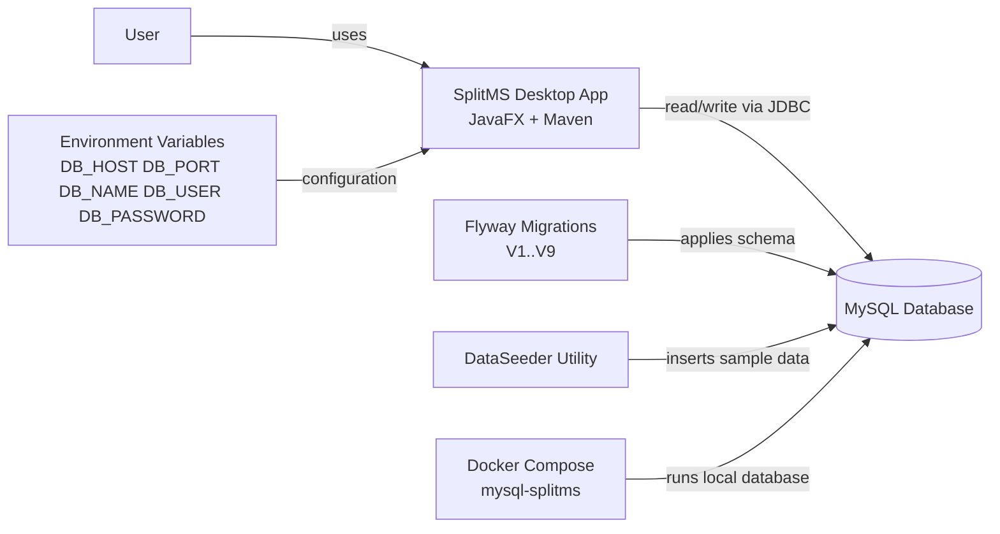
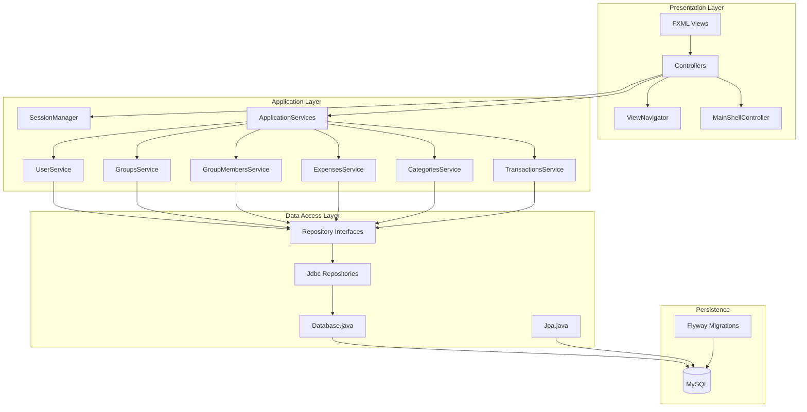
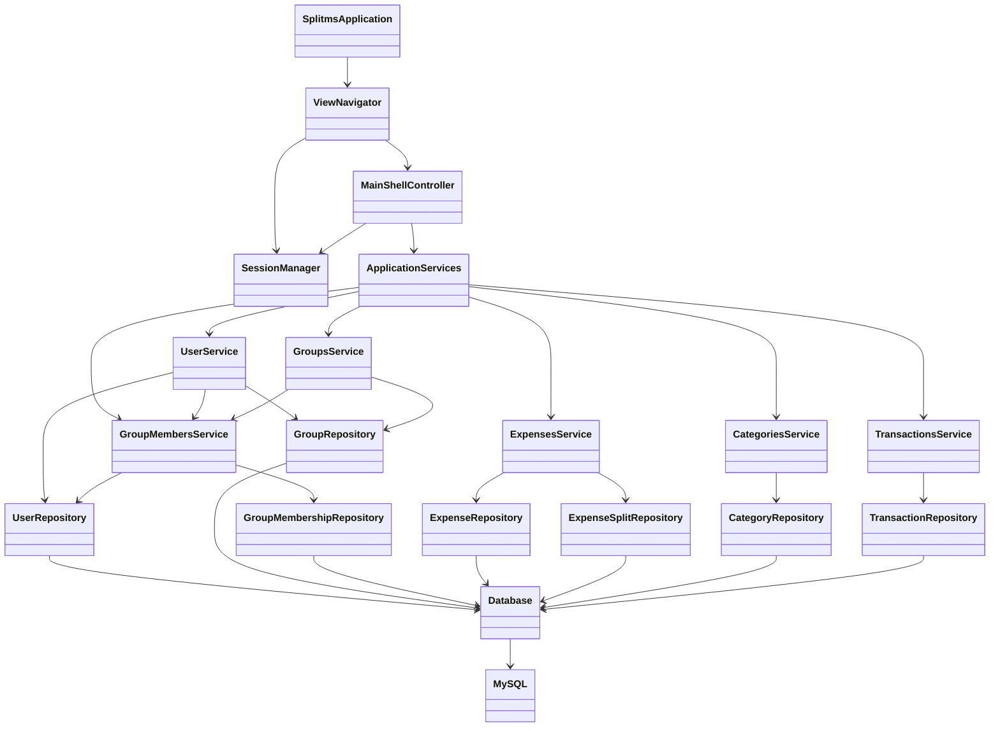
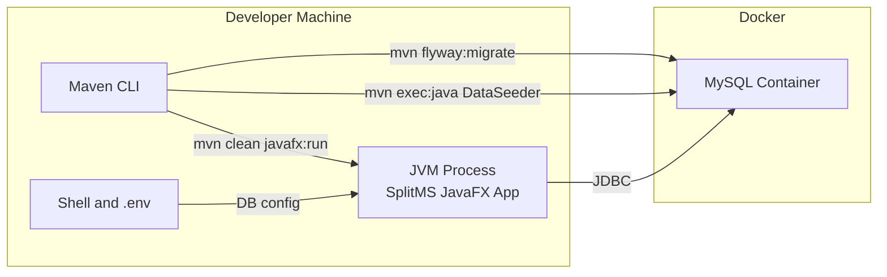
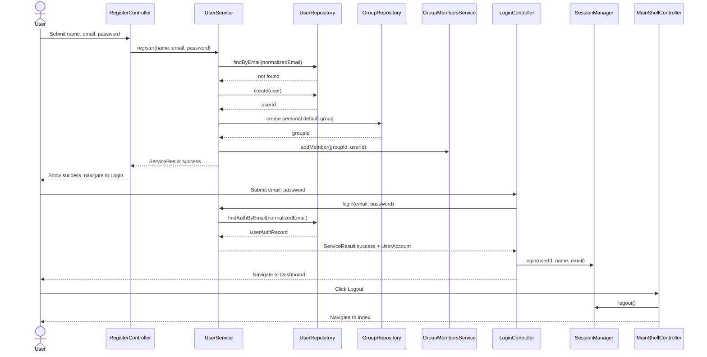
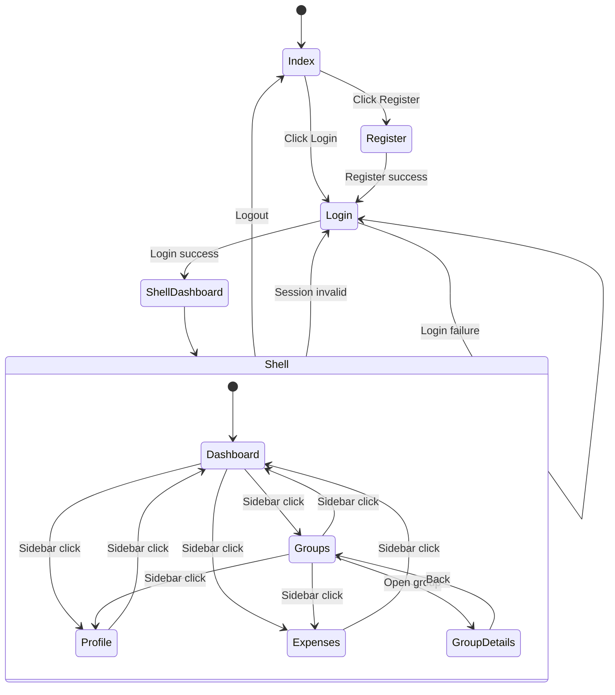
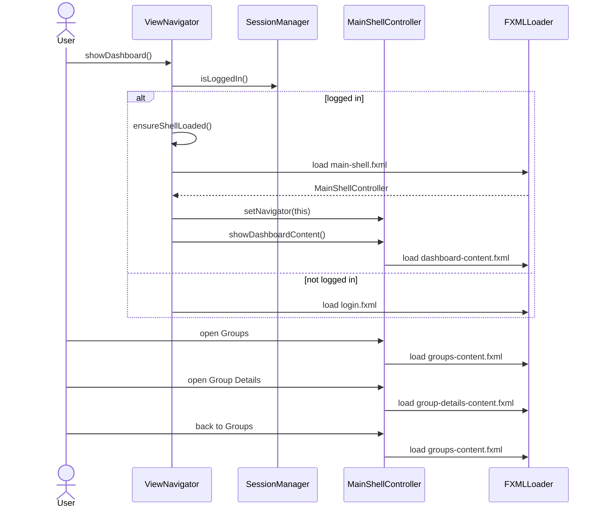
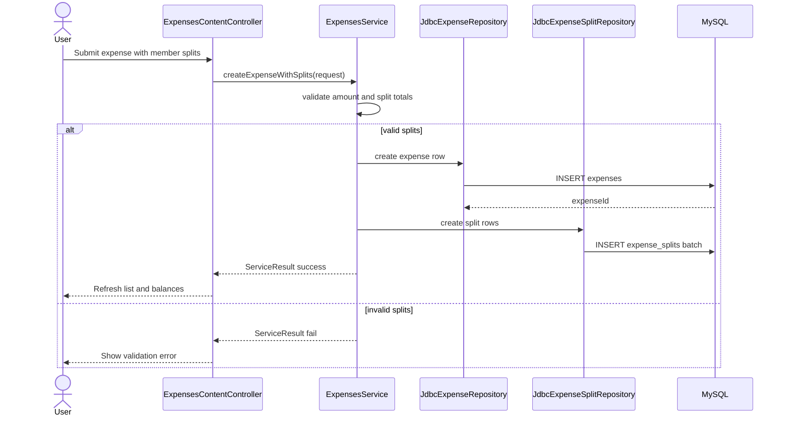
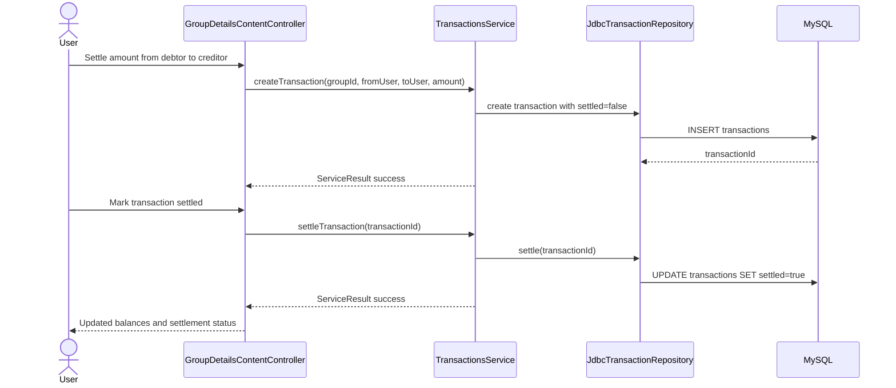
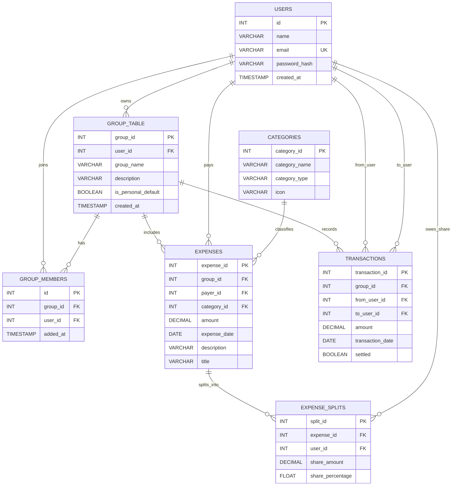

# SplitMS Architecture

This document is the architecture reference for SplitMS. It maps the complete codebase into system, runtime, behavioral, and data views.

## Architecture Scope

- Runtime context and deployment topology.
- Application layering from JavaFX controllers to MySQL.
- Component interactions across navigator, shell, services, and repositories.
- Core behavior flows: auth, navigation, expense creation, and settlement.
- Data model from Flyway migrations V1 through V9.

## Diagram Index

### Structural Views

- [System context](diagrams/system-context.mmd)
- [Runtime layered architecture](diagrams/runtime-layered.mmd)
- [Component map](diagrams/component-map.mmd)
- [Local deployment](diagrams/deployment-local.mmd)

### Behavioral Views

- [Authentication sequence](diagrams/sequence-auth.mmd)
- [Navigation state machine](diagrams/navigation-state.mmd)
- [Navigation content loading sequence](diagrams/sequence-navigation.mmd)
- [Expense creation with splits sequence](diagrams/sequence-expense-create.mmd)
- [Settlement transaction sequence](diagrams/sequence-settlement.mmd)

### Data Views

- [ERD from Flyway schema](diagrams/data-erd.mmd)

## System Context



## Runtime Layered Architecture



## Component Map



## Local Deployment Topology



## Authentication Sequence



## Navigation State Machine



## Navigation Loading Sequence



## Expense Creation Sequence



## Settlement Sequence



## ERD



## Design Invariants

- Service methods return ServiceResult<T> and controllers branch on success.
- SessionManager is the in-memory auth gate used by ViewNavigator.
- ViewNavigator enforces login before protected routes.
- MainShellController swaps content in a persistent shell container.
- Group table is named group in SQL and is quoted in JDBC SQL.
- expense_splits has unique(expense_id, user_id).
- group_members has unique(group_id, user_id).
- Services enforce split sum equals expense amount before persistence.
- User registration creates a personal default group.

## How To Keep Docs Current

Update these diagrams when any of the following changes:

- Navigation flow or protected route behavior.
- Service wiring or repository boundaries.
- Database migration files under src/main/resources/db/migration.
- Local deployment workflow for Docker, Flyway, or app startup.

## Optional Rendering

GitHub renders Mermaid directly in markdown code fences. If you need image exports, you can use Mermaid CLI:

```bash
npx @mermaid-js/mermaid-cli -i docs/architecture/diagrams/system-context.mmd -o docs/architecture/diagrams/system-context.svg
```
